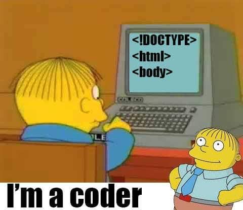

# strong p.ass generator
<p align="center">
   
</p>
<p align="center">


</p>
<p align="center">


</p>
<p align="center">
  <a></a>
</p>
<p align="center">
<b>• you can make bday web here for your friends,family,lovers, hehehe</b>
</p>
### Installation

- Just, Clone this repository -
```
$ git clone https://github.com/g3r0m4/bwc
```

- run - 
```
$ cd bwc
```
- tun first the install file
```
$ bash install.sh
```
- and wait then

- Run gen.py -
```
$ python3 bwc.py
```
